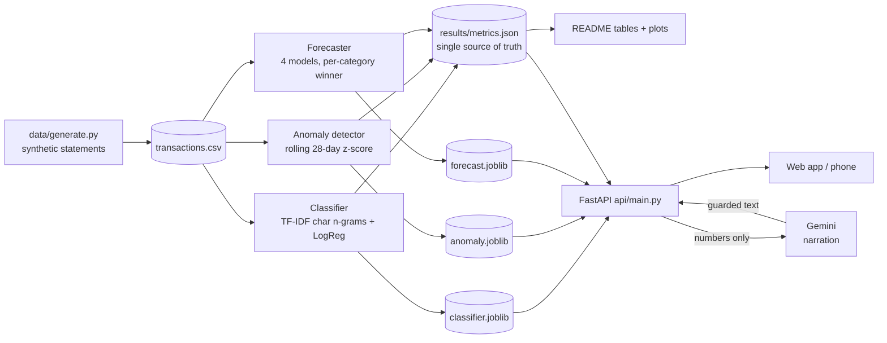
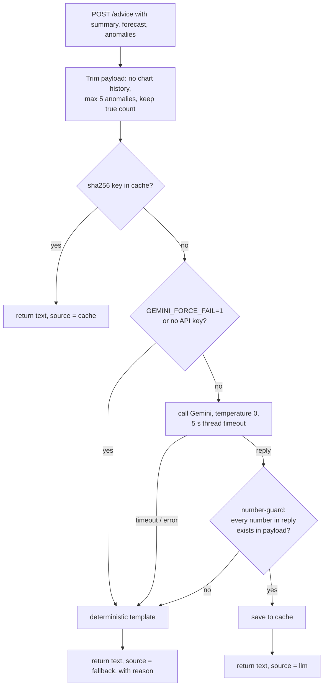

# PocketSmart AI: Complete Project Guide

This guide explains **what the project is, what it's for, how to use it, and exactly what happens behind the scenes**, with every supporting detail in one place.

> Quick links: [README.md](README.md) (results and evaluation) · [DECISIONS.md](DECISIONS.md) (why each choice was made) · [VIVA.md](VIVA.md) (exam Q&A) · [MODEL_CARD.md](MODEL_CARD.md) (model card) · [DEPLOY.md](DEPLOY.md) (Cloud Run deploy)

---

## Table of contents
1. [What PocketSmart AI is](#1-what-pocketsmart-ai-is)
2. [What it's used for](#2-what-its-used-for)
3. [How to use it](#3-how-to-use-it)
4. [What happens behind the scenes](#4-what-happens-behind-the-scenes)
5. [The three ML components in detail](#5-the-three-ml-components-in-detail)
6. [The Gemini narration layer](#6-the-gemini-narration-layer)
7. [How the numbers are kept honest](#7-how-the-numbers-are-kept-honest)
8. [API reference](#8-api-reference)
9. [Project structure (every file)](#9-project-structure-every-file)
10. [Configuration](#10-configuration)
11. [Real-data validation workflow](#11-real-data-validation-workflow)
12. [Build and deployment](#12-build-and-deployment)
13. [Results snapshot](#13-results-snapshot)
14. [Limitations and known failure modes](#14-limitations-and-known-failure-modes)
15. [Privacy and security](#15-privacy-and-security)
16. [Tech stack and versions](#16-tech-stack-and-versions)
17. [Command cheat-sheet](#17-command-cheat-sheet)
18. [Troubleshooting](#18-troubleshooting)
19. [Glossary](#19-glossary)
20. [FAQ](#20-faq)

---

## 1. What PocketSmart AI is

PocketSmart AI is a **personal-finance intelligence service** for Indian bank-statement data. It takes the cryptic transaction lines on a bank statement, such as:

```
UPI/423512345678/BUNDL TECHNOLOGIES/YESB0001234
POS 4521*ZOMATO ONLINE BANGA
NEFT-DR-HDFC-AMAZON PAY INDIA
ATM WDL 0912 SALEM TN
```

and answers four questions:

| Question | Answered by | Type of ML |
|---|---|---|
| *What did I spend on?* | **Classifier**: turns each messy string into one of 10 categories | Supervised text classification |
| *Is anything unusual?* | **Anomaly detector**: flags spends that are abnormally large for their category | Unsupervised statistics (rolling z-score) |
| *What will I spend next week?* | **Forecaster**: predicts next week's spend per category, with an 80% range | Time-series regression plus baselines |
| *Explain it to me simply* | **Gemini**: turns the numbers above into 2–4 plain-English sentences | LLM (narration only) |

### The core principle
> **The models compute. The LLM narrates. It never calculates or predicts.**

Every number the user sees comes from a measurable, evaluated ML component. Gemini only rephrases those numbers, and a software guard rejects any Gemini reply that contains a number it wasn't given.

### The 10 spending categories
| Category | What goes in it |
|---|---|
| Food & Dining | Restaurants, cafes, food delivery (Swiggy/Zomato meals), tea shops, street food |
| Groceries | Supermarkets, kirana stores, vegetables, milk, quick-commerce (Blinkit/Zepto/Instamart) |
| Transport | Cabs, autos, buses, trains (IRCTC), metro, fuel, parking, tolls/FASTag |
| Shopping | Clothes, electronics, e-commerce orders (Amazon/Flipkart/Myntra), household items |
| Bills & Utilities | Rent, electricity, water, mobile/broadband/DTH recharges, insurance, credit-card bills |
| Entertainment | Movies, OTT subscriptions (Netflix/Hotstar/Spotify), events, gaming |
| Health | Pharmacy, hospital, clinic, diagnostics/lab tests, doctor consultations |
| Education | School/college fees, courses, books, coaching, exam fees |
| Transfers | Money sent to or received from people or own accounts, salary credit, NEFT/IMPS to individuals |
| Miscellaneous | ATM cash withdrawals, bank charges, donations, anything that fits nowhere else |

---

## 2. What it's used for

### For an end user
- **Understand spending automatically.** There's no manual tagging. Paste or import statement lines and see where the money went, by category, with each category's share of the month.
- **Month-over-month comparison.** This month vs last month, overall and per category.
- **Catch unusual transactions.** It flags spends that are many standard deviations above your usual for that category. This is useful for spotting mistakes, duplicate charges or one-off big purchases.
- **Plan the coming week.** A per-category spend estimate for next week, with a realistic range and the model's historical error shown next to it, so you know how much to trust it.
- **Plain-English summary.** One button gives a short, readable explanation of the month.

### As an academic/engineering project
- A worked example of **honest ML evaluation**: time-based splits, baselines that are allowed to win, bootstrap confidence intervals, a significance test before picking a model, calibration checks, and a real human-labelled validation set with a **pre-registered** expectation.
- A reference for **safe LLM integration**: the LLM is confined to narration, with a number-guard, a cache, a timeout and a deterministic fallback, so the feature never breaks.
- A complete **deployable service**: FastAPI, a static mobile-first frontend, one container, Cloud Run, and a build that verifies the deployed model matches the published metrics.

### What it is NOT for
Credit scoring, lending or insurance decisions, fraud detection, tax/accounting classification, or investment advice. See [MODEL_CARD.md](MODEL_CARD.md).

---

## 3. How to use it

### 3.1 Start the app
From the project folder, in PowerShell:
```powershell
.venv\Scripts\python -m uvicorn api.main:app --port 8000
```
Then open **http://localhost:8000**. If this is a fresh clone, run the *first-time setup* in [README section 8](README.md#8-setup-and-run) first (it builds the data and models).

To use it on your phone over the same Wi-Fi or hotspot, add `--host 0.0.0.0` and open `http://<laptop-IP>:8000`. Once deployed, just open the Cloud Run URL.

### 3.2 The web app, section by section

**① Try a merchant string (the top card)**
- Type or paste any bank-statement line and press **Categorise**, or tap one of the example chips.
- You'll see:
  - the **predicted category** and the model's **confidence**;
  - a **CONFIDENT** or **UNCERTAIN: best guess** badge. "Uncertain" means the confidence is below the abstain threshold, so treat the label as a guess;
  - the **top 3** categories with probability bars;
  - **"model saw"**: the normalised string the model actually received (upper-cased, with long digit runs replaced by `#`).
- Try the rent example `IMPS/P2A/8812/KAVITHA R/rent` to see a realistic failure: a rent payment to a person looks like a transfer.

**② Overview**
- Pick a month from the dropdown (it defaults to the latest month in the data).
- **Total spend**, **top category**, and **vs last month** (green = spent less, red = spent more).
- **This month vs last** bar chart, per category.
- **Unusual transactions**: the flagged spends from the last 30 days, each with a sentence like *"₹7,860 is 12.8 standard deviations above your 28-day Bills & Utilities average of ₹777"*.

**③ Categories**
- A doughnut chart of spend share, plus a table with spend, share % and month-over-month change for every category.

**④ Next-week forecast**
- Choose a category. You'll see:
  - the **predicted spend** for the next week, and the **80% range** (the true value should land inside it about 80% of the time);
  - **Model used**: whichever of the four forecasting models had the lowest error on the held-out weeks *for this category*;
  - **Holdout MAE**: how many rupees that model was typically off by on the 8 held-out weeks;
  - **Interval hit rate**: how often the 80% range actually contained the true value on the holdout, plus "k/8", how many of the 8 weeks it beat the reference baseline.
- The chart shows 26 weeks of history, the forecast point and its range.
- Open **All categories** for the full table.

**⑤ Advice**
- Press **Explain my month**. The app sends the numbers shown above (summary, top forecasts, anomalies, and your last categorised string) to `/advice`.
- The reply says who wrote it:
  - **Gemini**: a live LLM answer that passed the number-guard;
  - **Gemini (cached)**: the same numbers were explained before, so it's served instantly;
  - **offline template (LLM unavailable)**: no API key, no network, a timeout, or a reply rejected by the guard. The text is built directly from the numbers.

**Footer links:** `/metrics` (every evaluation number, live), `/docs` (interactive API), `/health`, `/metrics/latency`.

### 3.3 Using the API directly
Open **http://localhost:8000/docs** to try every endpoint in the browser, or use PowerShell:
```powershell
# categorise strings
Invoke-RestMethod -Method Post -Uri http://localhost:8000/categorize -ContentType "application/json" `
  -Body '{"merchants": ["UPI/98765/SWIGGY/YESB0001", "ATM WDL 0912 SALEM TN"]}'

# monthly summary, forecast, anomalies
Invoke-RestMethod "http://localhost:8000/summary?month=2026-08"
Invoke-RestMethod "http://localhost:8000/forecast?category=Groceries"
Invoke-RestMethod "http://localhost:8000/anomalies?days=30"
```
The full reference is in [section 8](#8-api-reference).

---

## 4. What happens behind the scenes

### 4.1 The big picture



### 4.2 Offline pipeline (training and evaluation)
Run with `python -m src.evaluate --report`, which takes about a minute:

1. **Load** `data/transactions.csv` (generated by `data/generate.py`).
2. **Classifier:** time-split the rows (last 20% of dates = test) → train LogisticRegression and RandomForest → bootstrap CIs → McNemar test → pick the shipped model → calibration curve → abstain-threshold sweep → error analysis → save `models/classifier.joblib`.
3. **Anomaly detector:** compute per-transaction z-scores (raw and log) against the previous 28 days of the same category → sweep thresholds → AUC-PR → per-category precision → save `models/anomaly.joblib`.
4. **Forecaster:** aggregate to weekly spend per category → walk-forward evaluation of 4 models on the last 8 weeks → pick a winner per category → build 80% intervals from a separate calibration window → compute next week's prediction → save `models/forecast.joblib`.
5. **With `--report`:** run real-data validation (or print `SKIPPED`) → write `results/metrics.json` → draw 4 PNGs → write `error_analysis.md` and `real_errors.md` → rewrite the README tables from metrics.json.

Everything is seeded (seed 42), so running it twice gives a **byte-identical** `metrics.json`.

### 4.3 Online flow (when you use the app)
1. **At server start** (`api/main.py`, once): load the three joblib models, the transactions CSV, `metrics.json`, and the build-verification result, and compute the model's sha256. No model is ever loaded per request.
2. **Browser loads `/`**, the static `index.html`, `style.css` and `app.js`. Chart.js comes from a CDN. If it fails to load, the tables still render.
3. `app.js` calls `/health`, `/summary`, `/anomalies` and `/forecast` in parallel and renders the page.
4. **Categorise:** `POST /categorize` → normalise the string → TF-IDF → `predict_proba` → top-3 + confidence + `uncertain` flag.
5. **Advice:** `POST /advice` with the numbers already on screen → trimmed payload → Gemini (with cache, timeout, number-guard) or the template → text + source label.
6. A **middleware** times every request, and `/metrics/latency` reports p50/p95 per endpoint since boot.

### 4.4 The request lifecycle of `/advice` in detail



---

## 5. The three ML components in detail

### 5.1 Merchant-string classifier (`src/features.py`, `src/train_classifier.py`)

**Step 1: Normalisation** (`features.normalise`)
- Replace every run of **4 or more digits** with `#`. Phone numbers, UPI reference numbers and account numbers are random noise for categorisation, and masking also protects privacy.
- Convert to upper case and collapse whitespace.
- Example: `upi-zepto-zepto@axl-sbin0009391-242433739605-bill` → `UPI-ZEPTO-ZEPTO@AXL-SBIN#-#-BILL`

**Step 2: TF-IDF character n-grams (2–4)**
- The string is cut into overlapping character pieces (`SW`, `SWI`, `SWIG`, `WIG`, …), and each piece is weighted by how distinctive it is (TF-IDF).
- **Why characters, not words:** merchant strings are truncated (`ZOMATO ONLINE BANGA`), concatenated (`bundltechnol@upi`) and misspelt (`SWIGY`). Whole words break on all of these. Character pieces mostly survive.
- The vectorizer is fit on **training rows only**, inside a scikit-learn `Pipeline`, so the test set can't leak into the vocabulary.

**Step 3: Model**
- **LogisticRegression(class_weight="balanced")**: a linear model, where "balanced" stops big classes (Food) from drowning out small ones (Education).
- **RandomForest(class_weight="balanced_subsample")** is trained as a comparison.

**Step 4: Evaluation and selection**
- **Time-based split:** the last 20% of rows by date is the test set. It's never a random split, because a random split would train on the future.
- **Bootstrap:** the test set is resampled 1,000 times to give 95% confidence intervals for accuracy and macro-F1.
- **McNemar exact test:** compares the two models *on the same rows*, counting only the rows where exactly one of them is right. Rule, fixed in code: p ≥ 0.05 ships LR (the simpler model); p < 0.05 ships the model the test favours.
- **Leakage gate:** accuracy above 92% on synthetic data means the generator is leaking labels, and the script exits with an error. Below 78% means the generator is too noisy.

**Step 5: Calibration and abstaining**
- **Reliability curve and ECE:** checks whether "80% confident" really means right 80% of the time.
- **Abstain threshold:** confidence cut-offs from 0.30 to 0.90 are swept, and the lowest one where accuracy on the answered transactions is ≥ 95% is chosen. Anything below it is returned as `uncertain: true`.

**Step 6: Error analysis:** the 15 most confident wrong predictions are written to `results/error_analysis.md`.

### 5.2 Anomaly detector (`src/anomaly.py`)
- For every **debit**, it computes a z-score: *(amount − mean) ÷ standard deviation*, using only the **same category's** transactions from the **previous 28 days**. The current day is excluded, so a spike can't hide itself by inflating its own average.
- It needs at least 5 past transactions, and the first 28 days are warm-up.
- Two versions are evaluated: **raw-z** (rupees) and **log-z** (log of rupees). The version with the higher **AUC-PR** is served. Currently that's raw-z.
- **Threshold sweep** at |z| of 2.0, 2.5, 3.0, 3.5 and 4.0, with precision, recall, F1 and the TP/FP/FN/TN counts at each. The best-F1 threshold is served.
- It's scored against the hidden `is_anomaly` ground truth, which is injected by the generator and never used as a model input.
- **Per-category precision** is reported to show where the method breaks.

### 5.3 Weekly forecaster (`src/forecast.py`)
- Debits are aggregated to **weekly totals per category**, with weeks running Monday to Sunday. Only complete weeks are used.
- **Four models**, all reported:

| Model | Prediction for next week |
|---|---|
| `naive` | same as last week |
| `seasonal_naive` | same as 4 weeks ago (roughly the same point in the month) |
| `linear` | LinearRegression on the last 4 weeks plus week-of-month (one-hot) |
| `category_mean` | the average week in the training period (a constant) |

- **Evaluation:** the last **8 weeks** are held out. Each held-out week is predicted from the actual weeks before it (one-step walk-forward), and nothing is refit on the holdout.
- **Winner per category** = lowest holdout MAE. *If a baseline wins, the baseline is served.* That's a finding, not a failure.
- **"k/8" robustness check:** in how many of the 8 weeks did the winner beat the reference baseline? A winner at ≤ 4/8 is flagged "not robust".
- **80% interval:** the 10th–90th percentile of prediction errors from a **separate 16-week calibration window** before the holdout. Coverage is then measured on the holdout. If the window were the holdout itself, coverage would be 80% by construction and would prove nothing.
- **Live prediction:** the winning model (refit on all weeks, if it's linear) predicts the week after the data ends.

### 5.4 The synthetic data generator (`data/generate.py`)
- **24 months** (2024-09-01 → 2026-08-31) of daily transactions, about 9,500 rows, seed 42.
- **Amounts:** lognormal, with category-specific medians and spreads.
- **Patterns:** weekend spikes (Food, Entertainment, Shopping), rent and bills on the 1st–5th, salary credit on the 1st, and Diwali and Pongal spikes in Shopping and Groceries.
- **Messy strings:** UPI, POS, NEFT, IMPS, ACH, BIL/ONL, ECOM and ATM formats; bank codes (YESB, HDFC, SBIN…); legal entity names (Swiggy = BUNDL TECHNOLOGIES, Ola = ANI TECHNOLOGIES); truncation, random casing and trailing junk.
- **Designed ambiguity:** shared platforms across categories (Amazon Pay, Paytm, PhonePe, Swiggy…) and payments to people from one shared name pool, so the task isn't trivially easy.
- **2% anomalies:** amounts multiplied by 4–10×, flagged in `is_anomaly`.

---

## 6. The Gemini narration layer (`src/gemini.py`)

| What Gemini DOES | What Gemini does NOT do |
|---|---|
| Rephrase given numbers in 2–4 plain sentences | Calculate, add, average or estimate anything |
| Say which model made a forecast, and its typical error | Predict or forecast anything itself |
| Hedge when a category is `uncertain: true` | See raw transactions or merchant history |
| | Give investment or financial-product advice |

**Safety layers:**
1. **System prompt:** strict rules; temperature 0.
2. **Number-guard:** every number in the reply must match a number in the input, allowing rounding, absolute values and fraction → percent. Otherwise the reply is **rejected**.
3. **Cache:** the key is `sha256(model | prompt version | canonical JSON)`. The same numbers give an instant answer at zero cost.
4. **Timeout:** 5 seconds, enforced by a thread timeout. The SDK socket timeout sits at 10 s, because the Gemini API rejects anything shorter.
5. **Fallback template:** built only from the input JSON, with Indian digit grouping (₹4,04,791). `/advice` **never** returns a server error.
6. **Usage stats:** in `/health` → `llm`: calls, cache hits and misses, fallbacks, guard rejections, tokens, and estimated INR cost.

Model: `gemini-3.5-flash-lite` by default (chosen by a live latency test; see DECISIONS.md Phase 11), overridable with `GEMINI_MODEL` in `.env`. Check the name with `python -m src.gemini --list-models`.

---

## 7. How the numbers are kept honest

| Safeguard | What it prevents |
|---|---|
| Time-based splits everywhere | Training on the future |
| TF-IDF fit inside a Pipeline on train only | Test vocabulary leaking into training |
| Leakage gate (78–92% band) | Accepting a suspiciously easy synthetic task |
| Generator-only tuning, each round logged | Tuning the model toward a target number |
| Bootstrap CIs | Over-reading small differences |
| McNemar test with a pre-fixed rule | Picking the model that "looks" better by noise |
| Baselines that are allowed to win | Complexity for its own sake |
| Separate interval calibration window | Interval coverage that is 80% by construction |
| `metrics.json` as the single source of truth | Hand-typed numbers drifting from reality |
| README tables rendered from metrics.json | README and results disagreeing |
| Determinism check (two runs, byte-identical) | Hidden randomness |
| `verify_build.py` in the Docker build | The deployed model differing from the published one |
| Pre-registered real-data expectation | Moving the goalposts after seeing results |
| Label source tracked (`real` vs `synthetic_fallback`) | Presenting synthetic strings as real validation |

---

## 8. API reference

Base URL: `http://localhost:8000` locally, or your Cloud Run URL. Every request and response is validated by Pydantic schemas (`api/schemas.py`). Interactive docs are at `/docs`.

| Method | Endpoint | Input | Returns |
|---|---|---|---|
| GET | `/health` | none | status, model version and sha256, `metrics_verified`, data range, training rows, uptime, LLM usage stats |
| POST | `/categorize` | `{"merchants": ["...", ...]}` (1–100 strings) | per string: category, confidence, `uncertain`, `top_3`, normalised string; model name; abstain threshold |
| GET | `/summary` | `?month=YYYY-MM` (optional; default latest) | total spend, per-category totals, share %, month-over-month deltas, top category, available months |
| GET | `/forecast` | `?category=...` (optional; default all) | next-week prediction, `lower_80`, `upper_80`, `model_used`, `holdout_mae`, `holdout_mape`, `interval_coverage_holdout`, k/8, 26 weeks of history |
| GET | `/anomalies` | `?days=30` (1–365) | flagged transactions with z-score, typical amount and a plain-English reason |
| POST | `/advice` | any of `summary`, `forecast`, `anomalies`, `categorization` (the JSON from the endpoints above) | narration `text`, `source` (llm/cache/fallback), model, reason, LLM stats |
| GET | `/metrics` | none | `results/metrics.json` verbatim |
| GET | `/metrics/latency` | none | p50/p95 latency and count per endpoint since boot |
| GET | `/docs` | none | Swagger UI |
| GET | `/` | none | the web app |

**Error codes:** `422` for invalid input (e.g. `month=banana`), `404` for an unknown month or category. `/advice` always returns `200`.

---

## 9. Project structure (every file)

```
PocketAI/
├── api/
│   ├── main.py            FastAPI app: loads models once, all endpoints, latency middleware, serves frontend
│   └── schemas.py         Pydantic request/response models for every endpoint
├── data/
│   ├── generate.py        synthetic statement generator -> data/transactions.csv
│   ├── labelling_sheet.py builds the human-labelling sheets from real strings (digits masked)
│   └── ingest_labels.py   reads labels_a/b/c.csv -> real_validation.csv + Fleiss' kappa
├── src/
│   ├── config.py          every path, seed, threshold and constant in one place
│   ├── features.py        digit masking, normalisation, TF-IDF char n-gram vectorizer
│   ├── stats.py           bootstrap CI, exact McNemar, calibration/ECE/Brier, Fleiss' kappa
│   ├── train_classifier.py time split, LR vs RF, gate, CIs, McNemar, calibration, abstain, errors
│   ├── anomaly.py         rolling 28-day z-scores, sweep, AUC-PR, per-category precision
│   ├── forecast.py        weekly aggregation, 4 models, walk-forward, intervals, k/8
│   ├── validate_real.py   scores the shipped model on the real labelled set (skips if absent)
│   ├── evaluate.py        orchestrator: builds everything; --report writes metrics/plots/README
│   ├── verify_build.py    asserts the rebuilt model matches committed metrics (Docker step)
│   └── gemini.py          narration: prompt, number-guard, cache, timeout, fallback, stats
├── frontend/
│   ├── index.html         single page: merchant box, Overview, Categories, Forecast, Advice
│   ├── app.js             API calls, rendering, Chart.js charts, loading/error states
│   └── style.css          mobile-first light theme
├── tests/test_smoke.py    6 smoke tests (7 runs): endpoints, errors, /advice offline + timeout
├── results/
│   ├── metrics.json       SINGLE SOURCE OF TRUTH for every number (committed)
│   ├── error_analysis.md  15 most confident wrong predictions (committed)
│   └── *.png              confusion matrix, calibration, anomaly PR, forecast plots (regenerated)
├── docs/screenshot.png    app screenshot used in the README
├── models/                trained .joblib files (NOT in git; rebuilt by evaluate / Docker)
├── Dockerfile             python:3.11-slim; generate -> train -> verify at build time
├── .dockerignore / .gcloudignore   keep secrets, private data and local artefacts out of the build
├── .gitignore / .gitattributes     what git ignores; LF line endings for the Linux container
├── .env.example           template for GEMINI_API_KEY / GEMINI_MODEL / GEMINI_FORCE_FAIL
├── requirements.txt       exact pinned dependency versions
├── README.md              overview, results tables, limitations, run commands
├── PROJECT_GUIDE.md       this file
├── DECISIONS.md           every judgement call and why
├── VIVA.md                30 exam questions with answers
├── MODEL_CARD.md          intended use, data, failure modes, out-of-scope uses
└── DEPLOY.md              Cloud Run deploy commands
```

**Files that are never committed:** `.env`, `data/*.csv`, `data/real_strings_raw.txt`, `data/to_label*`, `data/labels_*`, `models/*.joblib`, `results/*.png`, `cache/`, `.venv/`.

---

## 10. Configuration

### Environment variables (`.env` locally, Cloud Run env vars when deployed)
| Variable | Default | Purpose |
|---|---|---|
| `GEMINI_API_KEY` | (none) | Gemini key. Without it, `/advice` uses the offline template |
| `GEMINI_MODEL` | `gemini-3.5-flash-lite` | which Gemini model narrates |
| `GEMINI_FORCE_FAIL` | `0` | set to `1` to simulate an LLM outage (demo and testing) |
| `GEMINI_THINKING_LEVEL` | `MINIMAL` | keeps latency inside the 5 s budget; set it empty for models that reject it (e.g. `gemini-flash-latest`, `gemini-3.8-flash`) |
| `POCKETSMART_CACHE_DIR` | `cache/` (`/tmp/...` in the container) | where the LLM response cache lives |

### Tunable constants (`src/config.py`)
| Constant | Value | Meaning |
|---|---|---|
| `SEED` | 42 | all randomness |
| `TEST_FRACTION` | 0.20 | last 20% of rows by date = classifier test set |
| `ACCURACY_BAND` | (0.78, 0.92) | leakage gate |
| `BOOTSTRAP_RESAMPLES` | 1000 | CI resamples |
| `MCNEMAR_ALPHA` | 0.05 | significance level for model selection |
| `ABSTAIN_TARGET_ACC` / `ABSTAIN_FALLBACK` | 0.95 / 0.70 | abstain-threshold rule |
| `ANOMALY_WINDOW_DAYS` | 28 | rolling window |
| `ANOMALY_Z_SWEEP` | 2.0 … 4.0 | thresholds evaluated |
| `FORECAST_HOLDOUT_WEEKS` | 8 | forecast test period |
| `FORECAST_CALIBRATION_WEEKS` | 16 | interval calibration window |
| `GEMINI_TIMEOUT_S` / `GEMINI_HTTP_TIMEOUT_MS` | 5.0 / 10000 | 5 s user-facing budget (thread timeout) / SDK socket timeout (the API rejects deadlines under 10 s) |
| `FLASH_USD_PER_1M_IN/OUT`, `USD_TO_INR` | 0.30 / 2.50 / 88 | cost estimate only. **Verify against current pricing** |

The ambiguity knobs of the generator (`PERSON_SHARE`, `TRUNCATE_P`, `ANOMALY_RATE`) are at the top of `data/generate.py`. Change them only if the leakage gate fires, and log every change in DECISIONS.md.

---

## 11. Real-data validation workflow

Synthetic test scores show that the *pipeline* works. Real strings show whether the *model* works.

1. Paste real statement lines into `data/real_strings_raw.txt`, one per line (the file is gitignored).
2. `python -m data.labelling_sheet` masks the digits and creates three sheets, `to_label_a/b/c.csv`. Each has **130 rows: 100 unique strings plus the same 30 anchor strings**, shuffled in. The 10 category definitions are in the header.
3. Three people fill the `category` column with exact category names and return `labels_a.csv`, `labels_b.csv` and `labels_c.csv`.
4. **Commit the pre-registered expectation in DECISIONS.md first.** Git history then proves it was written before the results.
5. `python -m data.ingest_labels` validates the names (unknown or blank → hard fail), computes **Fleiss' κ** and **pairwise agreement** on the 30 anchors, resolves anchors by majority vote (3-way ties are excluded and logged), and writes `data/real_validation.csv`.
6. `python -m src.evaluate --report` scores the model on the real strings: accuracy, macro-F1, per-class recall, the **generalisation gap** (synthetic minus real) and the **human ceiling**. It writes `results/real_errors.md` and fills README section 5.
7. Append "Outcome vs pre-registration" to DECISIONS.md. **No model, generator or threshold changes are allowed in response.** The gap is the finding.

If the real labels aren't there, every step prints `SKIPPED` and the project still runs and demos fully.

---

## 12. Build and deployment

- **One container:** the API, the models and the static frontend.
- The **Dockerfile** runs `python -m data.generate` → `python -m src.evaluate` → `python -m src.verify_build` at build time. Models are trained inside the image, never taken from git.
- `verify_build.py` recomputes test accuracy and macro-F1 and compares them with the committed `results/metrics.json` (tolerance 0.005). **A mismatch fails the build.** `/health` then shows `metrics_verified: true` and the model's sha256.
- Deploy with `gcloud run deploy pocketsmart --source . --region asia-south1 --allow-unauthenticated` (Cloud Build builds the image). The full steps, including adding the Gemini key safely and keeping one instance warm on demo day, are in [DEPLOY.md](DEPLOY.md).

---

## 13. Results snapshot

> These figures come from the committed `results/metrics.json` at the time of writing. The live values are at `/metrics`, and the README tables are always regenerated from that file.

| Component | Headline |
|---|---|
| Classifier (LogisticRegression, shipped) | accuracy **0.793** [0.774, 0.811], macro-F1 **0.746**, on 1,911 time-split test rows |
| RandomForest (comparison) | accuracy 0.778, macro-F1 0.760. Not shipped: McNemar p = 0.0081 in LR's favour |
| Calibration | ECE 0.160, **underconfident** (actual accuracy is above the stated confidence) |
| Abstain threshold | 0.65: answers on 56.8% of transactions with 95.4% accuracy on those |
| Anomaly detector | AUC-PR raw-z 0.386 vs log-z 0.335 (random = 0.020). Served: raw-z at \|z\| > 4.0 |
| Forecaster | Lowest mean MAE: linear. But the **category mean wins 5 of 10 categories** and beats linear in 7 of 10 |
| Forecast 80% intervals | mean holdout coverage 0.800 (per category 0.75–0.88) |
| Real data | *pending the human labels* |

---

## 14. Limitations and known failure modes

- **Synthetic training data.** It encodes the author's assumptions about Indian statements.
- **Text-only classifier.** It can't tell a rent payment to a person from a transfer to the same person, or a Swiggy Instamart grocery order from a Swiggy meal.
- **Underconfident probabilities.** Treat the confidence value as a ranking; the `uncertain` flag is calibrated on observed accuracy.
- **Anomaly window shorter than a billing cycle.** Monthly bills (credit card, rent, broadband) are compared against a 28-day window that doesn't contain last month's bill, so they get flagged. A window of 35 days or more, or a per-merchant baseline, would fix it.
- **Single z-score per category.** It breaks for multimodal categories (Bills mixes rent and small recharges) and heavy-tailed ones (Transfers).
- **Short holdout (8 weeks).** Coverage and k/8 move in coarse steps.
- **Selection on the evaluation data.** The per-category forecast winner and the anomaly threshold are chosen on the data they're reported on, so they're slightly optimistic.
- **Single user.** There's no authentication and no database, and everything is loaded into memory at startup.

---

## 15. Privacy and security

- **Digit masking:** runs of 4+ digits (phone numbers, UPI refs, account numbers) become `#` before any real string is written to disk, and the model uses the same masking on all input.
- **Private files are never committed or uploaded:** `.env`, real strings, labelling sheets and labels are gitignored *and* excluded from the Docker/Cloud Build upload.
- **API key:** it lives in `.env` locally, and is a Cloud Run environment variable when deployed (entered with `Read-Host` so it stays out of shell history). It's never in git or in the image.
- **The container runs as a non-root user.**
- **All user text is HTML-escaped in the frontend.**
- **The LLM only ever receives the models' numeric JSON,** never the transaction history.

---

## 16. Tech stack and versions

| Layer | Technology (pinned version) |
|---|---|
| Language | Python 3.11 |
| Data | pandas 3.0.6, numpy 2.4.6 |
| ML | scikit-learn 1.7.2, scipy 1.17.1, joblib 1.6.0 |
| Plots | matplotlib 3.11.2 |
| API | FastAPI 0.141.1, uvicorn 0.54.0, pydantic 2.13.5 |
| LLM | google-genai 2.25.0 (Gemini Flash tier) |
| Frontend | vanilla HTML/CSS/JS + Chart.js 4.4.4 (CDN), no build step |
| Tests | pytest 9.1.1, httpx 0.28.1 |
| Deploy | Docker (python:3.11-slim), Google Cloud Run via Cloud Build, region asia-south1 |
| Storage | CSV + joblib on disk. No database |

**Not used, on purpose:** SARIMAX/statsmodels, IsolationForest, embeddings, React/Streamlit, a database, authentication, CI/CD.

---

## 17. Command cheat-sheet

Run everything from the project folder in PowerShell.

| Task | Command |
|---|---|
| **Run the app** | `.venv\Scripts\python -m uvicorn api.main:app --port 8000` |
| Run it for your phone (same network) | `.venv\Scripts\python -m uvicorn api.main:app --host 0.0.0.0 --port 8000` |
| First-time: create the venv | `py -3.11 -m venv .venv` |
| First-time: install dependencies | `.venv\Scripts\python -m pip install -r requirements.txt` |
| Generate the synthetic data | `.venv\Scripts\python -m data.generate` |
| Train everything and refresh all numbers | `.venv\Scripts\python -m src.evaluate --report` |
| Train only (no report) | `.venv\Scripts\python -m src.evaluate` |
| Verify the models match the metrics | `.venv\Scripts\python -m src.verify_build` |
| Run each component on its own | `.venv\Scripts\python -m src.train_classifier` / `src.anomaly` / `src.forecast` |
| Smoke tests | `.venv\Scripts\python -m pytest tests -q` |
| Gemini demo | `.venv\Scripts\python -m src.gemini --demo` |
| Check Gemini model names | `.venv\Scripts\python -m src.gemini --list-models` |
| Simulate an LLM outage | `$env:GEMINI_FORCE_FAIL="1"` (set back to `"0"` afterwards) |
| Build the labelling sheets | `.venv\Scripts\python -m data.labelling_sheet` |
| Ingest the labels | `.venv\Scripts\python -m data.ingest_labels` |
| Real-data validation only | `.venv\Scripts\python -m src.validate_real` |
| Deploy | see [DEPLOY.md](DEPLOY.md) |

---

## 18. Troubleshooting

| Symptom | Cause | Fix |
|---|---|---|
| `DLL load failed … Application Control policy has blocked this file` | Windows Smart App Control checking a library on first use | Run the same command again |
| `address already in use` | a server is already running on port 8000 | stop it (`Ctrl + C` in its window), or use `--port 8001` |
| `FileNotFoundError: models\classifier.joblib` | models not built yet | `python -m data.generate` then `python -m src.evaluate --report` |
| Advice says "offline template" | no `GEMINI_API_KEY`, no network, a timeout, or the guard rejected the reply | add the key to `.env`. The reason is shown next to the text |
| `LEAKAGE SUSPECTED` / `BELOW BAND` from training | synthetic accuracy is outside 78–92% | adjust the generator knobs (not the model) and log it in DECISIONS.md |
| Cloud Build fails at `verify_build` | committed `metrics.json` is stale | run `python -m src.evaluate --report`, commit `results/`, redeploy |
| Charts missing on the phone | Chart.js CDN blocked or slow | the tables still show all the numbers. Reload on a better connection |

---

## 19. Glossary

| Term | Meaning |
|---|---|
| **UPI / NEFT / IMPS / POS / ACH** | Indian payment rails. They show up as prefixes in bank-statement narrations |
| **TF-IDF** | Term frequency × inverse document frequency. It weights text pieces by how distinctive they are |
| **Character n-gram** | An overlapping chunk of n characters (e.g. `SWI`, `WIG`) |
| **Accuracy** | Share of all predictions that are correct |
| **Precision / Recall** | Of the items flagged as X, how many really are X / of all the real X, how many were found |
| **F1 / macro-F1** | Harmonic mean of precision and recall / F1 averaged equally over all classes |
| **Confusion matrix** | Rows = true class, columns = predicted class. The diagonal is correct |
| **Bootstrap CI** | A confidence interval from resampling the test set many times |
| **McNemar test** | A paired test of whether two models' error rates differ on the same rows |
| **Calibration / ECE** | Whether confidence matches actual accuracy / the average gap between them |
| **Abstain threshold** | The confidence below which a prediction is marked `uncertain` |
| **z-score** | How many standard deviations a value is from the mean |
| **AUC-PR** | Area under the precision–recall curve. Random = the base rate |
| **MAE / MAPE** | Mean absolute error in rupees / mean absolute percentage error |
| **Walk-forward** | Predicting each test week using only the data before it |
| **Baseline** | A deliberately simple model (naive, seasonal naive, mean) that the complex model must beat |
| **80% prediction interval** | A range that should contain the true value about 80% of the time |
| **Fleiss' κ** | Chance-corrected agreement between several human labellers |
| **Generalisation gap** | Synthetic test accuracy minus real-data accuracy |
| **Pre-registration** | Writing down the expected result before seeing it |

---

## 20. FAQ

**Is any of my real financial data used?** Not for training. Only the optional real-validation strings are used, digit-masked and kept out of git and the container.

**Does it need the internet?** Only for Gemini and the Chart.js CDN. Without internet, categorisation, summaries, forecasts and anomalies all work, and Advice uses the offline template.

**Why does the forecaster sometimes use a "dumb" baseline?** Because on the held-out weeks it was more accurate. Serving the model that actually performs best, even when it's simple, is the honest choice.

**Why is a prediction marked uncertain even though it's correct?** "Uncertain" means the model's confidence is low. It says the model *might* be wrong, not that it *is* wrong.

**Can I change the categories?** Edit `CATEGORIES` in `src/config.py` and the generator's merchant lists in `data/generate.py`, then re-run `python -m src.evaluate --report`. The labelling sheets pick up the new definitions automatically.

**How do I know the live site uses the same model as the README?** Open `/health`: `metrics_verified: true` means the build retrained the model and confirmed it reproduces `results/metrics.json`. `/metrics` serves that exact file.
