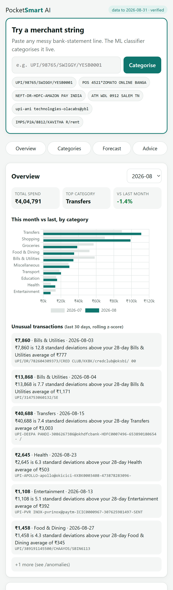

# PocketSmart AI

Personal-finance intelligence built on three measured ML components: a merchant-string **classifier**, a spending **anomaly detector** and a weekly **spend forecaster**. Gemini only turns their JSON output into plain English.
**The models compute. The LLM narrates. It never calculates or predicts.**

- **Live:** _pending deploy. The URL goes here after `gcloud run deploy`._
- **API docs:** `<live-url>/docs` · **Every number, live:** `<live-url>/metrics`



> Every figure in this README is rendered from [`results/metrics.json`](results/metrics.json) by `python -m src.evaluate --report`. Nothing is hand-typed. The deployed container retrains from source, and `src/verify_build.py` fails the build if the model doesn't reproduce these numbers.

---

## 1. Problem framing

Indian bank statements describe spending with strings like `UPI/4235.../BUNDL TECHNOLOGIES/YESB...` or `POS 4521*ZOMATO ONLINE BANGA`. To answer "where did my money go, is anything unusual, and what's coming next week?" you have to:

1. **Categorise** noisy merchant strings into 10 spending categories (text classification).
2. **Flag** transactions that are unusually large *for their category* (unsupervised anomaly detection).
3. **Forecast** next week's spend per category, with an honest uncertainty band (time-series regression).
4. **Explain** the result in two to four sentences a non-technical person can act on. This is the only step that uses an LLM, and the LLM is only allowed to rephrase numbers it was given.

The evaluation is built to resist self-deception: a time-based split everywhere, baselines that are allowed to win, bootstrap confidence intervals, a significance test before choosing between models, calibration checks, and a real human-labelled validation set whose expected result was written down *before* the labels were seen ([DECISIONS.md](DECISIONS.md)).

## 2. Data

**The training and test data are SYNTHETIC.** No real person's transactions were used to train anything. The generator, [`data/generate.py`](data/generate.py), produces daily transactions with:

- category-specific lognormal amounts, weekend spikes for food and entertainment, rent and bills on the 1st–5th of each month, salary credit on the 1st, and Diwali/Pongal spikes in shopping and groceries;
- **messy Indian merchant strings**: UPI, POS, NEFT, IMPS, ACH and ATM formats, legal entity names (Swiggy → BUNDL TECHNOLOGIES), truncation, random casing and trailing junk;
- **deliberate label ambiguity**: shared platforms (Amazon Pay, Paytm, Swiggy…) appear in several categories, and payments to individuals come from one shared name pool, so an auto driver and a kirana owner look alike, as they do on real statements;
- a hidden `is_anomaly` column (injected amount outliers), used **only** to score the detector.

<!-- METRICS:DATA:START -->
- **Synthetic**, generated by `data/generate.py` (seed 42): **9,508 transactions**, 2024-09-01 → 2026-08-31 (24 months), 10 categories.
- Injected ground-truth anomalies: 190 (2.00% of rows), used only for scoring.

| category | rows |
|---|---|
| Food & Dining | 2,724 |
| Groceries | 1,444 |
| Transport | 1,887 |
| Shopping | 868 |
| Bills & Utilities | 377 |
| Entertainment | 476 |
| Health | 322 |
| Education | 165 |
| Transfers | 755 |
| Miscellaneous | 490 |
<!-- METRICS:DATA:END -->

A separate **real validation set** of human-labelled strings from real bank statements measures how well the model transfers to real data (section 5).

## 3. Approach

| Component | Method | Why this and not something fancier |
|---|---|---|
| Classifier | TF-IDF **character** 2–4-grams → LogisticRegression(class_weight="balanced"). RandomForest as the comparison | Char n-grams survive truncation, concatenation and typos in non-language strings. A linear model is fast, deterministic and explainable. The choice between the two models is made by a McNemar test, not by eyeballing |
| Anomaly detector | Rolling per-category z-score over the *previous* 28 days (today excluded), log and raw variants | No labels exist in real life. A z-score is transparent ("this is N standard deviations above your usual") |
| Forecaster | Naive, seasonal-naive (4 weeks back), category mean, LinearRegression on lags 1–4 + week-of-month | Baselines are first-class. The served model per category is whichever wins on held-out error |
| Narration | Gemini (Flash tier) via `google-genai`, temperature 0 | It receives only the models' JSON. A number-guard rejects any reply containing a number that isn't in the input. A deterministic template is the fallback, so `/advice` can't fail |

Split discipline: **time-based everywhere, never random.** The classifier tests on the last 20% of dates, and the forecaster holds out the last 8 complete weeks.

## 4. Evaluation, with baselines

### 4.1 Classifier
<!-- METRICS:CLASSIFIER:START -->
Time-based split: train 2024-09-01..2026-04-04 (n=7,597), test 2026-04-05..2026-08-31 (n=1,911). 95% CIs from 1000 bootstrap resamples of the test set.

| model | accuracy [95% CI] | macro-F1 [95% CI] |
|---|---|---|
| LogisticRegression | 0.793 [0.774, 0.811] | 0.746 [0.721, 0.768] |
| RandomForest | 0.778 [0.759, 0.796] | 0.760 [0.735, 0.784] |

**McNemar exact test** (LR vs RF on the same test rows): LR-only correct = 71, RF-only correct = 42, p = 0.0081. **Shipped: LogisticRegression.** McNemar p=0.00815 < 0.05: significant difference in error rate in favour of LogisticRegression (71 vs 42 discordant wins); higher macro-F1 was RandomForest.

Per-class report (LogisticRegression):

| category | precision | recall | F1 | support |
|---|---|---|---|---|
| Food & Dining | 0.939 | 0.858 | 0.897 | 522 |
| Groceries | 0.936 | 0.596 | 0.728 | 272 |
| Transport | 0.946 | 0.806 | 0.870 | 387 |
| Shopping | 0.708 | 0.852 | 0.773 | 176 |
| Bills & Utilities | 0.567 | 0.702 | 0.628 | 84 |
| Entertainment | 0.690 | 0.825 | 0.751 | 97 |
| Health | 0.792 | 0.836 | 0.813 | 73 |
| Education | 0.575 | 0.767 | 0.657 | 30 |
| Transfers | 0.561 | 0.881 | 0.685 | 168 |
| Miscellaneous | 0.610 | 0.706 | 0.654 | 102 |
| **overall** | | accuracy **0.793** | macro-F1 **0.746** | 1,911 |

Leakage gate (accuracy band 0.78–0.92): **OK**.


<!-- METRICS:CLASSIFIER:END -->

The 15 most confident wrong predictions are listed in [results/error_analysis.md](results/error_analysis.md).

### 4.2 Anomaly detector (vs injected ground truth)
<!-- METRICS:ANOMALY:START -->
Evaluated on 9,084 debits after warm-up; 184 true anomalies.

**log-z**, AUC-PR = 0.335 (random = base rate 0.020)

| \|z\| > | precision | recall | F1 | TP | FP | FN | TN |
|---|---|---|---|---|---|---|---|
| 2.0 | 0.231 | 0.658 | 0.342 | 121 | 403 | 63 | 8497 |
| 2.5 | 0.391 | 0.440 | 0.414 | 81 | 126 | 103 | 8774 |
| 3.0 | 0.495 | 0.283 | 0.360 | 52 | 53 | 132 | 8847 |
| 3.5 | 0.549 | 0.152 | 0.238 | 28 | 23 | 156 | 8877 |
| 4.0 | 0.571 | 0.065 | 0.117 | 12 | 9 | 172 | 8891 |

**raw-z**, AUC-PR = 0.386 (random = base rate 0.020)

| \|z\| > | precision | recall | F1 | TP | FP | FN | TN |
|---|---|---|---|---|---|---|---|
| 2.0 | 0.279 | 0.728 | 0.404 | 134 | 346 | 50 | 8554 |
| 2.5 | 0.336 | 0.668 | 0.447 | 123 | 243 | 61 | 8657 |
| 3.0 | 0.368 | 0.592 | 0.454 | 109 | 187 | 75 | 8713 |
| 3.5 | 0.414 | 0.522 | 0.462 | 96 | 136 | 88 | 8764 |
| 4.0 | 0.458 | 0.473 | 0.465 | 87 | 103 | 97 | 8797 |

**Served:** raw-z at \|z\| > 4.0 (higher AUC-PR variant, best-F1 threshold; threshold chosen on the scored data, so its F1 is optimistic).

Per-category precision at the served threshold (this is where the method breaks):

| category | flagged | TP | FP | precision | recall |
|---|---|---|---|---|---|
| Food & Dining | 39 | 30 | 9 | 0.769 | 0.492 |
| Groceries | 27 | 14 | 13 | 0.518 | 0.438 |
| Transport | 27 | 15 | 12 | 0.556 | 0.484 |
| Shopping | 21 | 9 | 12 | 0.429 | 0.474 |
| Bills & Utilities | 27 | 5 | 22 | 0.185 | 0.417 |
| Entertainment | 11 | 5 | 6 | 0.455 | 0.625 |
| Health | 9 | 3 | 6 | 0.333 | 0.333 |
| Education | 5 | 2 | 3 | 0.400 | 1.000 |
| Transfers | 16 | 2 | 14 | 0.125 | 0.333 |
| Miscellaneous | 8 | 2 | 6 | 0.250 | 0.500 |


<!-- METRICS:ANOMALY:END -->

### 4.3 Forecaster (8-week holdout)
<!-- METRICS:FORECAST:START -->
104 complete weeks. Holdout = last 8 weeks (2026-07-06 → 2026-08-24), one-step-ahead walk-forward, no refit on holdout.

| Model | mean MAE (INR) | mean MAPE (%) | categories won |
|---|---|---|---|
| naive | 6,524.75 | 92.37 | 1 |
| seasonal_naive | 5,559.34 | 101.04 | 1 |
| linear | 4,251.39 | 74.32 | 3 |
| category_mean | 4,352.68 | 103.27 | 5 |

Lowest mean MAE: **linear**. **The category-mean baseline beats LinearRegression in 7 of 10 categories (Groceries, Transport, Shopping, Entertainment, Health, Education, Transfers).**

| category | naive | seasonal naive | linear | category mean | served | beat reference (k/8) |
|---|---|---|---|---|---|---|
| Food & Dining | 2,319 | 4,687 | 1,993 | 2,101 | linear | 7/8 vs seasonal_naive |
| Groceries | 5,215 | 5,124 | 4,172 | 3,280 | category_mean | 5/8 vs seasonal_naive |
| Transport | 1,658 | 3,112 | 1,769 | 1,425 | category_mean | 7/8 vs seasonal_naive |
| Shopping | 10,552 | 12,651 | 5,312 | 4,771 | category_mean | 6/8 vs seasonal_naive |
| Bills & Utilities | 11,926 | 9,554 | 4,961 | 8,843 | linear | 6/8 vs seasonal_naive |
| Entertainment | 1,726 | 2,057 | 1,441 | 1,100 | category_mean | 6/8 vs seasonal_naive |
| Health | 1,185 | 1,293 | 1,121 | 956 | category_mean | 6/8 vs seasonal_naive |
| Education | 2,129 | 4,646 | 3,163 | 3,071 | naive | 6/8 vs seasonal_naive |
| Transfers | 22,319 | 8,618 | 14,946 | 14,124 | seasonal_naive | 8/8 vs naive |
| Miscellaneous | 6,220 | 3,853 | 3,636 | 3,857 | linear | 4/8 vs seasonal_naive ⚠ not robust |

(per-category cells are holdout MAE in INR)


<!-- METRICS:FORECAST:END -->

## 5. Validation on real data (headline result)

The synthetic test score shows the *pipeline* works. This section shows whether the *model* works on real bank strings. Three people labelled real statement strings (digits masked for privacy). A block of anchor strings was labelled by all three, to measure how much humans agree, which is the realistic ceiling for any model. The expected result was committed to [DECISIONS.md](DECISIONS.md) **before** the labels were ingested, and nothing was tuned afterwards.

<!-- METRICS:REAL:START -->
**Pending.** The human labels haven't been ingested yet, so `src/validate_real.py` reported `SKIPPED`. This section is filled automatically by `python -m src.evaluate --report` once `data/real_validation.csv` exists.
<!-- METRICS:REAL:END -->

## 6. Uncertainty and calibration

<!-- METRICS:UNCERTAINTY:START -->
- **Classifier calibration** (LogisticRegression, synthetic test): ECE = **0.1596**, Brier (top-1) = 0.1316. 
- **Abstain threshold = 0.65** (lowest threshold with accuracy_on_covered >= 0.95): the model answers on 0.568 of test transactions with accuracy 0.954 on those; below the threshold `/categorize` returns `uncertain: true`.

| threshold | coverage | accuracy on covered |
|---|---|---|
| 0.30 | 0.908 | 0.854 |
| 0.35 | 0.863 | 0.877 |
| 0.40 | 0.824 | 0.895 |
| 0.45 | 0.780 | 0.911 |
| 0.50 | 0.736 | 0.925 |
| 0.55 | 0.687 | 0.934 |
| 0.60 | 0.638 | 0.948 |
| 0.65 | 0.568 | 0.954 |
| 0.70 | 0.483 | 0.970 |
| 0.75 | 0.375 | 0.981 |
| 0.80 | 0.266 | 0.996 |
| 0.85 | 0.160 | 1.000 |
| 0.90 | 0.075 | 1.000 |

- **Forecast 80% intervals** (residual quantiles from a separate 16-week calibration window, 2026-03-16 → 2026-06-29): mean holdout coverage **0.800** vs target 0.80. Per category: Food & Dining 0.750, Groceries 0.750, Transport 0.750, Shopping 0.875, Bills & Utilities 0.750, Entertainment 0.875, Health 0.750, Education 0.875, Transfers 0.875, Miscellaneous 0.750
<!-- METRICS:UNCERTAINTY:END -->

## 7. What didn't work, and limitations

<!-- METRICS:FINDINGS:START -->
- **RandomForest has the higher macro-F1 (0.760 vs 0.746) but is not shipped.** McNemar (p = 0.0081) says LR makes significantly fewer errors overall. RF trades overall accuracy for small-class recall.
- **Weakest classes:** Bills & Utilities (F1 0.628), Miscellaneous (F1 0.654). Payments to individuals are ambiguous from the text alone.
- **The shipped classifier is underconfident** (ECE 0.160): on average its accuracy is 0.152 above its stated confidence. Balanced class weights plus L2 regularisation spread probability across 10 classes. The abstain threshold is picked from *observed* accuracy, not from the raw probability, so it stays valid.
- **My log-z hypothesis was wrong.** I expected z on log(amount) to win because amounts are lognormal. Raw-z scored AUC-PR 0.386 against log-z's 0.335. Multiplicative outliers are only a modest shift in log space when a category's spread is wide.
- **Anomaly precision collapses where a category is multimodal or heavy-tailed:** Transfers 0.125, Bills & Utilities 0.185.
- **A constant beat the regression in 7 of 10 forecast categories.** Weekly spend in most categories is close to noise around a mean. Lag features let the regression chase last week's noise.
- **Not robust:** Miscellaneous. The lowest-MAE model won no more than half of the holdout weeks, so its 'win' is one or two lucky weeks.
<!-- METRICS:FINDINGS:END -->

Structural limitations:
- **Synthetic training data.** The generator encodes my assumptions about Indian statements. The real-data section measures how wrong those assumptions are, and it doesn't fix them.
- **Text-only classifier.** Amount, time and merchant history aren't used. A small morning payment to a person and the monthly rent paid to the same person look identical to it.
- **One z-score per category** assumes a single typical amount. Categories that mix very different payments (rent and a phone recharge are both "Bills") break that assumption.
- **The 28-day anomaly window is shorter than a monthly billing cycle.** Last month's bill has always left the window by the time this month's arrives, so recurring monthly bills are systematically flagged. A window of 35 days or more, or a per-merchant baseline, would fix it. It was left as specified and is reported here.
- **Short holdouts.** Eight forecast weeks means coverage and "weeks won" move in coarse steps, so treat per-category differences as indicative.
- **Selection on the evaluation set.** The per-category forecast winner and the anomaly threshold are picked on the same data they're reported on, so those two figures are slightly optimistic. This is stated in `metrics.json`.
- **Single user, no auth, no database**, by design (see [DECISIONS.md](DECISIONS.md)).

## 8. Setup and run

Requirements: Python 3.11. All dependencies are pinned in `requirements.txt`.

```bash
python -m venv .venv
.venv/Scripts/python -m pip install -r requirements.txt   # Windows; use .venv/bin/python on Linux/macOS
cp .env.example .env                                      # add GEMINI_API_KEY (optional; there is a fallback)

python -m data.generate              # synthetic data  -> data/transactions.csv
python -m src.evaluate --report      # train everything, write results/metrics.json, plots, README tables
python -m src.verify_build           # check the models reproduce metrics.json
uvicorn api.main:app --reload        # http://localhost:8000  (frontend at /, docs at /docs)
python -m pytest tests -q            # smoke tests
```

Real validation set (optional; the pipeline skips it cleanly without it):

```bash
python -m data.labelling_sheet       # needs data/real_strings_raw.txt -> to_label_a/b/c.csv
# labellers return data/labels_a.csv, labels_b.csv, labels_c.csv
python -m data.ingest_labels         # -> data/real_validation.csv, Fleiss' kappa
python -m src.evaluate --report      # README section 5 fills in
```

Deploy (Cloud Run, asia-south1): see [DEPLOY.md](DEPLOY.md).

More detail: [DECISIONS.md](DECISIONS.md) records every judgement call · [VIVA.md](VIVA.md) has the questions and answers · [MODEL_CARD.md](MODEL_CARD.md) is the model card.
